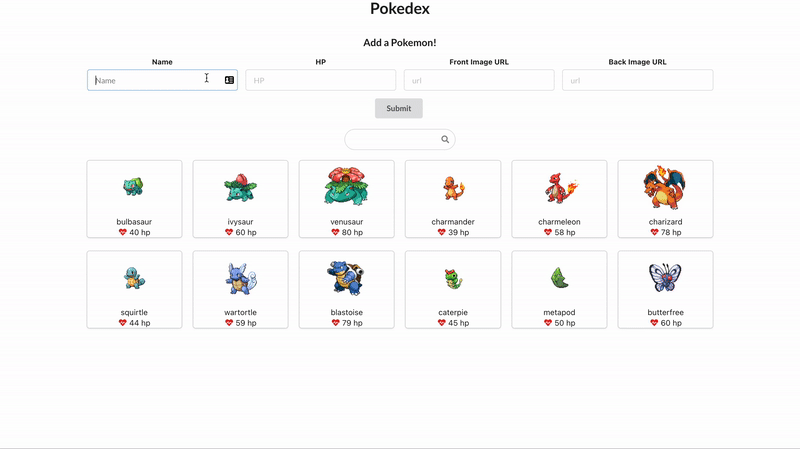

# Personal Pokedex Lab

You'll be building the following project: 

## Features

0. On load of the page, a user see a list of pokemon cards displaying each pokemon's name, front sprite, and HP level.
1. A user can fill out and submit the form to create a new pokemon. This will display the new pokemon on the page and the new pokemon data should persist, even after the page is refreshed. This means you'll have to make a POST request to the API!
2. A user can use the search bar to filter pokemon by name.
3. A user can click on a pokemon card to toggle seeing its front sprite or back sprite.
4. The form must be a controlled component.
5. This assignment must use React Context.

### Tip: Sprites

You can find pokemon sprites in this [GitHub Repo](https://github.com/PokeAPI/sprites/tree/master/sprites/pokemon). But you should use the raw URL. For example, `https://raw.githubusercontent.com/PokeAPI/sprites/master/sprites/pokemon/<filename>.png` and `https://raw.githubusercontent.com/PokeAPI/sprites/master/sprites/pokemon/back/<filename>.png`

## Set Up

Make sure you `cd` into the project directory.

In one terminal, run `npm install` to set up dependencies. Then run `npm start` to start the React App. This is your Front-End.

In another temrinal, run `json-server --watch db.json --port 4000` to start a mock back-end server on port 4000. If you get an error, make sure you have JSON server installed globally by running `npm install -g json-server`. Now, you will have a RESTful API that you can access via the URL `http://localhost:4000/pokemon`.

## JSON Server API

Json Server is a tool to we use to spin up a mock API. It is a great alternative to consuming from a API when you don't have the time to build out a full Express API. It does have its limitation in that it cannot support a robust relationships database. If you need a refresher, see the JSON Server documentation [here](https://github.com/typicode/json-server#getting-started).

You will be getting pokemon data from the URL `http://localhost:4000/pokemon`.

In order for your data to persist, you will be POSTing to the same URL `http://localhost:4000/pokemon`. 

Remember, for JSON Server, you will need to include a `Content-Type: application/json` header. For the body of the request, see the data structure of the existing pokemon as an exmple.

## Bonus:

Add a feature to **additionally** filter pokemon by the HP amount. You can use any type of input, but we reccommend using a [range input](https://developer.mozilla.org/en-US/docs/Web/HTML/Element/input/range). For example, if the user sets the range value to 50, then only show pokemon with an HP value _equal to or over_ 50. Remember to store that value of the input in state! 
